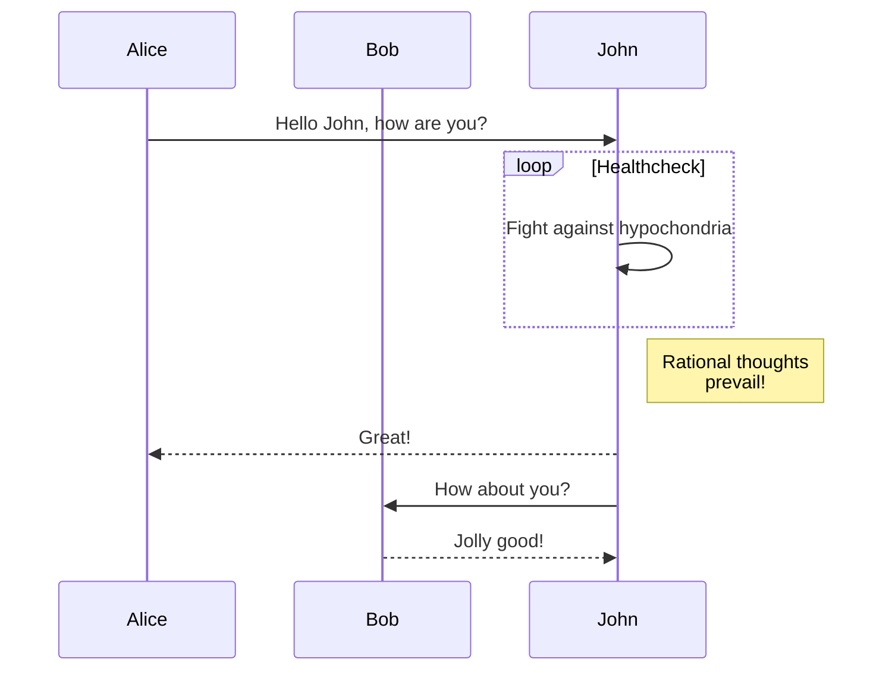

# Milestone 1

## Requirements:
No outside access.
Fully tested.
It has inventory, Owners. 
It accepts bids and asks
It matches orders and manages the inventory accordingly.
It can show its inventory.

## Todo
- [x] We need some way to have orders placed.
- [ ] We need some way to match orders [FIFO](https://www.cmegroup.com/confluence/display/EPICSANDBOX/Supported+Matching+Algorithms#:~:text=Trade%20Futures%20Allocation-,FIFO,is%20the%20first%20order%20matched.).
- [ ] We need some way to notify buyers and sellers of trades.
- [ ] We need some way for new products to be added.
- [ ] We need some way for traders to be regirstered.

#### Placing orders
*We acccept the following:*
product: the unique identifier of the product the order relates to.
type: bid | aks (bid for buying and ask for selling)
qty: number of products the order is for.
amount: value of a single qty of the product in cents. This will be mutliplied by qty to get to total order value.

### How do you test the exchange? 
TBD

A working exchange, with listed products, where an order can be placed, matched and confirmed. The exchange will use a simple matching algorithm for starters.

